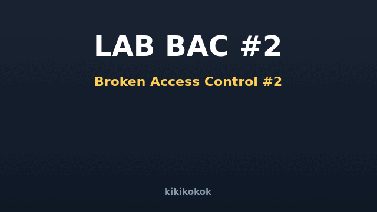

<div align="center">
  
  <h1>🧩 LAPORAN PRAKTIKUM — Broken Access Control (Bagian 2)</h1>
  <p><b>LAB-RED Team · Tugas Kuliah Keamanan Web</b> · dibuat oleh <b>kikikokok</b></p>
  <p>PHP 8 + MariaDB · OWASP Top 10 Web 2021 — <b>A01 Broken Access Control</b> · ⚠️ lokal saja</p>
</div>

---

## 1. Tujuan

Pada Lab #1 sudah dieksplorasi IDOR & akses fungsi tanpa otorisasi. Lab #2 menelusuri
**pola otorisasi yang salah diterapkan**: `Referer`, `cookie`, `metode HTTP`, kolom
tersembunyi/mass assignment, IDOR massal, serta *security by obscurity*.

## 2. Menjalankan

```bash
./jalankan.sh          # DB lab_bac2 + server :8093
./jalankan.sh stop
```

## 3. Temuan & Alur Eksploitasi

### 3.1 · Otorisasi Berbasis Header `Referer` (spoofable)
- **File:** `admin/panel.php`
- **Cek palsu:** `str_starts_with($_SERVER['HTTP_REFERER'], 'https://lantai1.admin')`.
- **Eksploit (Referer bisa dipalsukan peminta):**
  ```bash
  curl -s "http://127.0.0.1:8093/admin/panel.php" \
       -e "https://lantai1.admin"                  # -e = set Referer
  ```
  Seluruh password & data pengguna tampil **tanpa login sama sekali**.

### 3.2 · Otorisasi Berbasis Cookie (client-side trust)
- **File:** `login.php` + `cek_login()` di `includes/koneksi.php`
- Login membuktikan identitas lewat cookie `login_user` / `login_role` — yang bisa diubah user.
- **Eksploit (DevTools):** set `login_role = admin` → semua endpoint yang mengecek
  cookie langsung percaya bahwa kamu admin.

### 3.3 · Method-Based Access Control (salah kaprah)
- **File:** `admin/aksi.php`
- Alur "aman" keliru: tidak sembarang fungsi dipanggil, hanya karena berbentuk `POST`/`DELETE`.
- **Eksploit:**
  ```bash
  curl -s -X POST   -d "akun=FK-1005" http://127.0.0.1:8093/admin/aksi.php
  curl -s -X DELETE -d "akun=FK-1004" http://127.0.0.1:8093/admin/aksi.php
  ```
  Faktur terhapus tanpa autentikasi — membuktikan memakai metode adalah **bukan** pengaman.

### 3.4 · Mass Assignment / Object Attribute Injection
- **File:** `profil.php`
- Update kolom dibangun langsung dari seluruh `$_POST` — termasuk `role`.
- **Eksploit:** kirim `POST /profil.php` dengan tambahan `role=admin` →
  kolom role di database berubah meski tak ada input-nya di form asli.

### 3.5 · IDOR Batch (request massal)
- **File:** `export.php`
- Menerima array `ids[]` lalu mengambil data tanpa cek kepemilikan.
- **Eksploit:**
  ```
  export.php?ids[]=1&ids[]=2&ids[]=3&ids[]=4&ids[]=5
  ```
  Satu request → seluruh akun bocor.

### 3.6 · IDOR Write (mengubah milik orang lain)
- **File:** `faktur.php`
- Update `alamat_kirim` berdasarkan `faktur` yang dikirim user; tidak dicek kepemilikan.
- **Eksploit:** `POST faktur=4&alamat=Rumah Penyerang` → alamat kirim riko berubah.

### 3.7 · Static File Disclosure
- **File:** `files/data-pelanggan.txt`
- Di-serve langsung oleh web server tanpa lapisan PHP/otorisasi.
- **Eksploit:** buka URL-nya langsung → dokumen internal bocor.

### 3.8 · Security by Obscurity / Forced Browsing
- **File:** `tools/backup-x7f3.php`
- "Keamanan" bergantung pada nama file yang tak biasa + cek cookie role.
- **Eksploit:** dengan cookie `login_role=admin` (lihat 3.2) → forced browse ke file
  "tersembunyi" berhasil; back-up pengguna tampil.

## 4. Root Cause

| # | Kelas | Akar masalah |
|---|-------|--------------|
| 1 | Referer-based auth | Header dikendalikan client → bukan bukti otorisasi. |
| 2 | Cookie-based auth | Sumber identitas dari client, bisa dimanipulasi. |
| 3 | Method-based control | Memakai HTTP method sebagai pengganti authorization. |
| 4 | Mass assignment | Bind seluruh input ke model tanpa allowlist. |
| 5‑6 | IDOR batch/write | Tidak ada cek kepemilikan objek. |
| 7 | Static disclosure | File sensitif ditaruh di webroot. |
| 8 | Obscurity | Kerahasiaan bergantung pada nama file (bukan kontrol akses). |

## 5. Rekomendasi Mitigasi

```php
// 1+2: role dari DATABASE, bukan header/cookie, dan pastikan login server-side
function aktor(): array {
    if (($_SESSION['uid'] ?? 0) <= 0) { http_response_code(403); exit; }
    $s = $pdo->prepare('SELECT id,role FROM users WHERE id=?');
    $s->execute([$_SESSION['uid']]);
    $u = $s->fetch() ?: null;
    if (!$u) { http_response_code(403); exit('harus login'); }
    return $u;
}
function butuh($role, array $me): void {
    if ($me['role'] !== $role) { http_response_code(403); exit('403'); }
}

// 3: sebelum menghapus, PASTIKAN aktor itu admin — bukan sekadar metode POST
butuh('admin', aktor());
if (hash_equals($_SESSION['csrf'], $_POST['csrf'] ?? '')) { /* lanjut */ }

// 4: allowlist kolom yang boleh di-update
$kolom = ['nama', 'telepon', 'alamat'];        // role TIDAK ada di sini

// 5+6: cek kepemilikan objek
if ((int)$me['id'] !== (int)$objek['user_id']) { http_response_code(403); exit; }

// 7: letakkan file sensitif DI LUAR webroot, layani lewat PHP + otorisasi
// 8: hapus "keamanan" obscurity → ganti akses kontrol eksplisit.
```

## 6. Kesimpulan

Otorisasi harus bersumber dari **sesi server + kredensial per-peran yang disimpan server**,
bukan dari apa yang dikirim/dapat diubah klien (Referer, cookie, metode HTTP, kolom form).
Setiap akses fungsi & akses objek wajib diverifikasi. Security by obscurity & method-based
"guard" bukanlah kontrol akses — keduanya mudah diputar oleh penyerang yang tahu langkahnya.

## 7. Kredit

Lab & dokumentasi disusun oleh **kikikokok** untuk tugas mata kuliah keamanan web.
Data dummy; hanya untuk lingkungan pembelajaran lokal.

---
*LAB BAC #2 — Broken Access Control · watermark "kikikokok" tertanam di setiap halaman (CSS overlay), footer, dan komentar kode.*