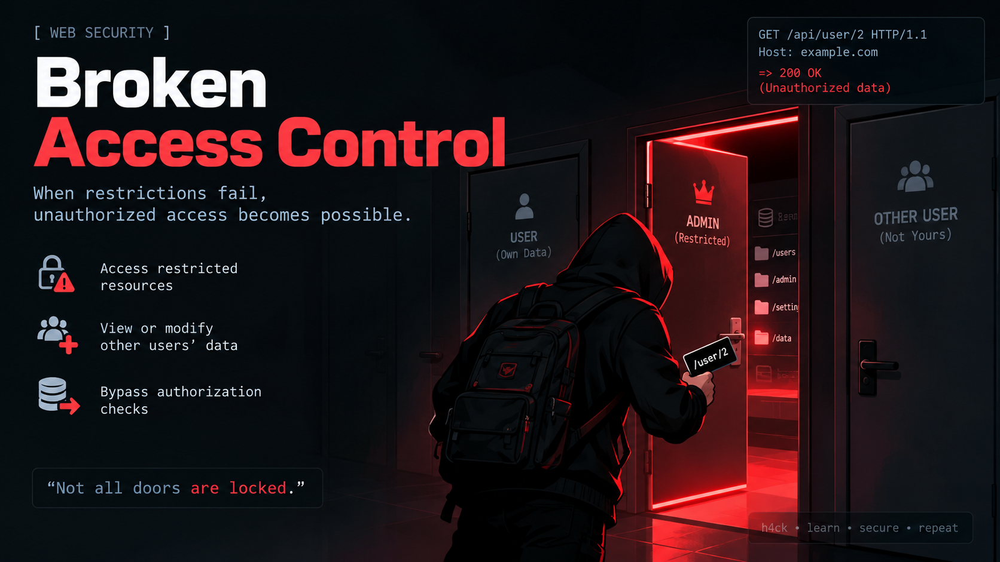

<div align="center">
  
  <h1>🧩 LAB-RED Team — Broken Access Control (Bagian 2)</h1>
  <p><b>Tugas Kuliah Keamanan Web</b> · dibuat oleh <b>kikikokok</b></p>
  <p>PHP 8 + MariaDB · OWASP Top 10 Web 2021 — <b>A01 Broken Access Control</b></p>
  <p>⚠️ Khusus praktikum lokal — jangan dijalankan di server publik/produksi.</p>
</div>

---

Kelanjutan [LAB BAC #1](https://github.com/ManuelKy08/lab-bac) dengan **pola BAC baru**
yang lebih dalam dari sekadar IDOR & panel terbuka:

| # | Latihan | Pola Kerentanan |
|---|---------|-----------------|
| 1 | [admin/panel.php](admin/panel.php) + header `Referer: https://lantai1.admin` | Otorisasi berbasis Referer (spoofable) |
| 2 | Ubah cookie `login_role=admin` | Otorisasi berbasis cookie (client-side trust) |
| 3 | POST/DELETE ke [admin/aksi.php](admin/aksi.php) tanpa login | Method-based access control |
| 4 | [profil.php](profil.php) POST + `role=admin` | Mass assignment |
| 5 | [export.php?ids[]=1&ids[]=2…](export.php?ids[]=1&ids[]=2&ids[]=3&ids[]=4&ids[]=5) | IDOR batch |
| 6 | [faktur.php](faktur.php) ubah alamat milik orang lain | IDOR write |
| 7 | [files/data-pelanggan.txt](files/data-pelanggan.txt) tanpa login | Static file disclosure |
| 8 | [tools/backup-x7f3.php](tools/backup-x7f3.php)+cookie admin | Security by obscurity / forced browsing |

## 🔎 Inti Pembelajaran

Bug BAC tidak selalu berbentuk "tombol admin yang terlihat lalu bisa diakses".
Sering kali akses salah diimplementasi lewat **Referer**, **cookie**, **metode HTTP**,
atau **tersembunyi**. Latihan ini melatih membaca kode & memahami *sumber kebenaran* otorisasi.

## 🚀 Menjalankan

```bash
./jalankan.sh           # import DB lab_bac2 + server :8093
./jalankan.sh stop      # matikan
# buka http://127.0.0.1:8093
```

## 🔑 Akun Demo

| Username | Password | Role | Catatan |
|----------|----------|------|---------|
| admin    | admin123 | admin | |
| staff    | staff123 | staff | |
| budi     | budi123  | pelanggan | |
| sari     | sari123  | pelanggan | |
| riko     | riko123  | pelanggan | |

> Semua password disimpan plaintext (disengaja). Login memakai **cookie** yang dapat
> diubah sendiri lewat DevTools — lihat `login_role`.

## 📁 Struktur

```
lab-bac2/
├── BAC2.png              # preview aplikasi (slot paling atas)
├── README.md · LAPORAN.md
├── jalankan.sh           # peluncur
├── database/lab_bac2.sql # users + faktur
├── includes/ · assets/   # koneksi, layout, CSS (watermark kikikokok)
├── index.php · profil.php · export.php · faktur.php
├── login.php · logout.php
├── admin/                # panel.php (Referer), aksi.php (method-based)
├── tools/backup-x7f3.php # rahasia via forced browsing
└── files/data-pelanggan.txt # static file disclosure
```

## 📝 Dokumentasi Lengkap

Alur tiap serangan + kode perbaikan → **[`LAPORAN.md`](LAPORAN.md)**

---

<div align="center">
  <small>LAB BAC #2 — Broken Access Control · dibuat oleh <b>kikikokok</b> untuk tugas kuliah</small>
</div>
